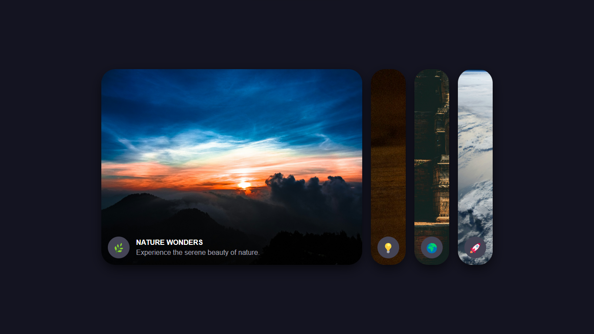

# Interactive Flex Cards Gallery

This project is a simple **interactive flex card gallery** that allows users to explore different themed cards with smooth transitions and animations.

## Demo



## Features
- Fully responsive interactive card layout
- Smooth animations using **CSS transitions**
- Themed categories: Nature, Technology, Culture, and Space
- Easy to customize and extend

## Installation
1. Clone the repository:
   ```sh
   git clone https://github.com/nayandas69/Flex-Cards.git
   ```
2. Open the project folder:
   ```sh
   cd Flex-Cards
   ```
3. Open `index.html` in your browser:
   ```sh
   open index.html  # MacOS
   start index.html  # Windows
   ```

## Usage
- Click on a card to expand and view details.
- Cards smoothly transition between views.
- Fully responsive layout works on mobile and desktop.

## Technologies Used
- **HTML** – Structure
- **CSS** – Styling & Animations

## YouTube Tutorial 📺
Watch the step-by-step guide on YouTube: [](https://youtu.be/C8n2N_chkRg)

## Contributing
Feel free to fork this project, submit pull requests, or suggest improvements!

## License
This project is licensed under the MIT License.

---
Made with ❤️ by [Nayan Das](https://github.com/nayandas69).
